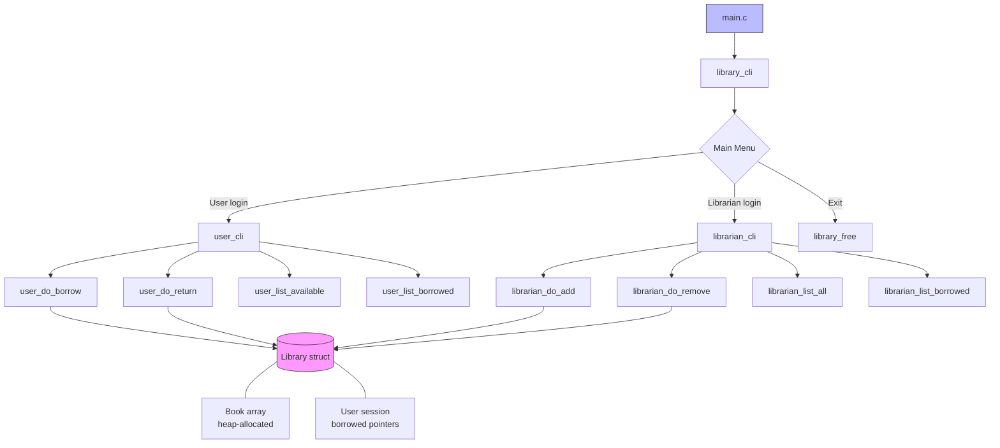

# C Library Management System

[](https://github.com/frankwyf/c-library-system/actions/workflows/ci.yml)
[](https://codecov.io/gh/frankwyf/c-library-system)
[](LICENSE)
[](https://en.wikipedia.org/wiki/C99)
[](CONTRIBUTING.md)

A console-based library management system written in **C99**.  
Supports book cataloguing, borrowing/returning, and librarian administration — with full unit-test coverage and GitHub Actions CI/CD.

---

## 🌐 Documentation

| Language | Link |
|----------|------|
| 🇬🇧 English | [README.md](README.md) *(this file)* |
| 🇨🇳 中文 | [docs/README_CN.md](docs/README_CN.md) |
| 🇯🇵 日本語 | [docs/README_JP.md](docs/README_JP.md) |

---

## Features

| Feature | User | Librarian |
|---------|:----:|:---------:|
| Browse available books | ✓ | ✓ |
| Borrow a book (up to 4) | ✓ | — |
| Return a borrowed book | ✓ | — |
| View my borrowed books | ✓ | — |
| View all catalogue entries | — | ✓ |
| View currently borrowed books | — | ✓ |
| Add a new book | — | ✓ |
| Remove a book | — | ✓ |

---

## Quick Start

### Prerequisites

| Tool | Minimum version |
|------|----------------|
| GCC or Clang | GCC ≥ 7 / Clang ≥ 6 |
| CMake | ≥ 3.14 *(for tests)* |
| Git | any recent version |

### Build with Make (Linux / macOS)

```bash
git clone https://github.com/frankwyf/c-library-system.git
cd c-library-system
make
./build/library data/books.txt
```

### Build with CMake (cross-platform)

```bash
cmake -B build -DCMAKE_BUILD_TYPE=Release
cmake --build build

# Linux / macOS:
./build/library data/books.txt

# Windows (MinGW):
build\library.exe data\books.txt
```

### Run Tests

```bash
cmake -B build -DCMAKE_BUILD_TYPE=Debug
cmake --build build
ctest --test-dir build --output-on-failure
```

### Generate Coverage Report (Linux / macOS, GCC/Clang only)

```bash
make coverage          # builds with --coverage and generates coverage-html/
# or manually:
cmake -B build -DCMAKE_BUILD_TYPE=Debug -DENABLE_COVERAGE=ON
cmake --build build --parallel
ctest --test-dir build --output-on-failure
lcov --capture --directory build --output-file coverage.info
lcov --remove coverage.info '*/unity/*' '*/tests/*' '/usr/*' -o coverage.info
genhtml coverage.info --output-directory coverage-html
```

---

## Book File Format

Each record occupies two non-blank lines (author, then title), separated from the next by a blank line:

```
Frank Herbert
Dune

Isaac Asimov
I, Robot
```

A sample catalogue is provided at [`data/books.txt`](data/books.txt).

---

## Project Structure

```
c-library-system/
├── .github/
│   ├── workflows/
│   │   └── ci.yml                ← GitHub Actions CI/CD
│   ├── ISSUE_TEMPLATE/
│   │   ├── bug_report.yml        ← Bug report form
│   │   └── feature_request.yml   ← Feature request form
│   └── PULL_REQUEST_TEMPLATE.md  ← PR checklist
├── src/
│   ├── structures.h        ← Core data types (Book, User, Library)
│   ├── main.c              ← Entry point
│   ├── library.[ch]        ← Initialisation, file I/O, main CLI loop
│   ├── librarian.[ch]      ← Librarian operations (add / remove / list)
│   ├── user.[ch]           ← User operations (borrow / return / list)
│   └── utility.[ch]        ← Input helpers
├── tests/
│   ├── test_library.c      ← Unit tests: library module   (7 tests)
│   ├── test_user.c         ← Unit tests: user module      (10 tests)
│   ├── test_librarian.c    ← Unit tests: librarian module  (9 tests)
│   └── test_utility.c      ← Unit tests: utility module  (10 tests)
├── data/
│   └── books.txt           ← Sample book catalogue (12 titles)
├── docs/
│   ├── README_CN.md        ← Chinese documentation
│   └── README_JP.md        ← Japanese documentation
├── .clang-format           ← clang-format style rules
├── .editorconfig           ← Editor whitespace / indent settings
├── Makefile                ← GNU Make (Linux / macOS)
├── CMakeLists.txt          ← CMake build + tests + coverage
├── clib.json               ← clib package manifest
├── LICENSE                 ← MIT Licence
├── CONTRIBUTING.md         ← Contribution guide
├── CHANGELOG.md            ← Version history
├── SECURITY.md             ← Security / vulnerability reporting
└── CODE_OF_CONDUCT.md      ← Code of conduct
```

---

## Architecture



---

## Design Notes

- **Single-user session**: one `User` struct is active per run; their borrowed list is cleared on logout.
- **Testability**: all business-logic functions (`user_do_borrow`, `user_do_return`, `librarian_do_add`, `librarian_do_remove`) are non-interactive and directly unit-testable via the Unity framework. Interactive wrappers handle I/O separately.
- **Error handling**: functions return `LIB_OK` / `LIB_ERR` instead of calling `exit()`, making them composable and testable.
- **Catalogue capacity** defaults to 64 books and 4 borrowed per user; both limits can be overridden at compile time: `-DMAX_BOOKS=128 -DMAX_BORROWED=8`.

---

## CI/CD Pipeline

| Job | Tool | Purpose |
|-----|------|---------|
| Build & Test | CMake + CTest | Compile & run 51 unit tests on Linux, macOS, Windows |
| Coverage | gcov + lcov + Codecov | Track line/branch coverage |
| Valgrind | Valgrind 3.x | Detect memory leaks & use-after-free |
| Sanitizers | ASan + UBSan | Runtime memory & UB detection |
| Static Analysis | cppcheck | Catch warnings, style, performance issues |
| Format Check | clang-format | Enforce consistent code style |
| Release | softprops/action-gh-release | Multi-platform binary distribution on tags |

---

## Contributing

Contributions are welcome! Please read [CONTRIBUTING.md](CONTRIBUTING.md) first.

## Licence

[MIT](LICENSE) © 2026 frankwyf
